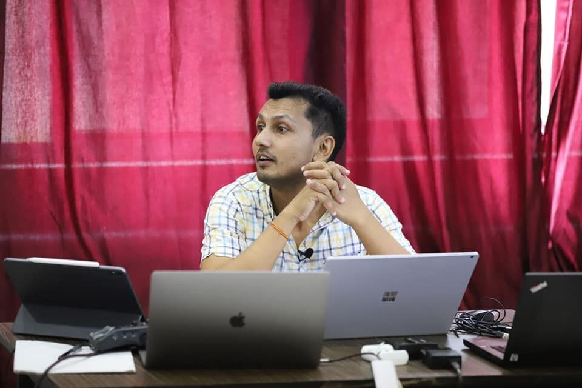

# Table of Contents

- [Table of Contents](#table-of-contents)
- [Project Topic](#project-topic)
  - [Authors](#authors)
- [Project Documentation](#project-documentation)
  - [Project Description](#project-description)
  - [Init and Setup](#init-and-setup)
- [Our Details](#our-details)
  - [🖥️🛠️ Support and 📞 Contact Information](#️️-support-and--contact-information)
  - [🚀 About Us](#-about-us)
    - [ YouTube Channels](#-youtube-channels)
    - [ Social Media Groups](#-social-media-groups)
  - [🔗 Contact Links](#-contact-links)
    - 
  - [📝 Feedback and Suggestions](#-feedback-and-suggestions)
 
# Project Topic

A brief description of what this project does and who it's for

## Authors

- [Jiwan Bhattarai](https://www.linkedin.com/in/jiwanbhattarai/)
- [Subash Chaudhary](https://www.github.com/subash729)

# Project Documentation
## Project Description

- Light/dark mode toggle
- Live previews
- Fullscreen mode
- Cross platform

## Init and Setup

# Our Details

<B>"IT Education Nepal"</B>  and <B>"Neplese IT study community"</B> work together to provide freely available and complete IT education to everybody, including basic to advanced courses like programming, networking, system and server administration, Cloud infrastructure, IT security and graphic design. This effort is motivated by a desire to provide great education for free, with a focus on empowering students, teachers, and IT professionals equally. We aim to transform education by creating a culture of continuous learning and knowledge sharing for the benefit of Nepali society through a youth-driven, non-profit platform.  
 

<B><U>CCIE #60261 Jiwan Bhattarai</U></B> sir leads this study community, along with our dedicated team, to improve IT education literacy in Nepali. Our mission is to provide learners with practical skills and technical knowledge while also developing a collaborative supportive learning environment. Join our team to gain for more contribution.

## 🖥️🛠️ Support and 📞 Contact Information

For support or inquiries, feel free to reach out to us through the following channels:

* **<U>Jiwan Bhattarai</U>**
  - **📧 Email**: [pingjiwan@gmail.com](mailto:pingjiwan@gmail.com)
  - **📱 Phone**: +977 9866358671
  - **Viber/Whatsapp/Telegram**: +977 9866358671

* **<U>Subash Chaudhary</u>**
  - **📧 Email**: [subaschy729@gmail.com](mailto:subaschy729@gmail.com)
  - **📱 Phone**: +977 9823827047
  - **Viber/Whatsapp/Telegram**: +977 9823827047

## 🚀 About Us

We are a team of security professionals and DevOps Engineers dedicated to ensuring robust network security and efficient cloud infrastructure. Our security expertise includes certifications such as CCNA and CCNP (2012), as well as achieving the prestigious CCIE #60261 (2018). Specializing in technologies like CISCO ASA, FTD, ISE, PaloAlto, and Fortinet, we provide multivendor network security solutions. Additionally, our team holds certifications as Certified Ethical Hackers (CEH) and in Redhat Linux, enabling us to effectively safeguard digital assets. 
 

In addition to our security focus, we excel in DevOps practices, specializing in Network and Systems, as well as Cloud technologies. Our proficiency extends to Kubernetes, containerization, Continuous Integration and Continuous Deployment (CI/CD), and Infrastructure as Code (IAC) using industry-standard tools like Terraform and CloudFormation. With our comprehensive skill set, we ensure both security and efficiency in our clients' IT environments.

###   YouTube Channels
 

  <a href="https://www.youtube.com/@NepaliITStudyCommunity" style="text-align: center;">
    
    
Nepali IT Study Community

  </a>
  <a href="https://www.youtube.com/@iteducationnepal-6725" style="text-align: center;">
    
    
IT Education Nepal

  </a>

 
 

###   Social Media Groups

  <a href="https://t.me/jiwanbhattarai" style="text-align: center;">
    
    
Learning Updates/ IT learning community🌱🥇📖

  </a>
   <a href="https://t.me/jiwanbhattarai" style="text-align: center;">
    
    
Jiwan Bhattarai Official

  </a>

 
 

## 🔗 Contact Links
<!-- picture section -->

### 

  <a href="https://t.me/pingccie" style="text-align: left;">
    
  
<B>#CCIE 60261 Jiwan Bhattarai Sir</B>

   
  </a>
    <a href="https://t.me/subash729" style="text-align: left;">
    
  
 <B>Er. Subash Chaudhary</B>

   
  </a>
  

<!-- Comment for link section -->

  
  <a>

    
   
   
   
   

  </a>
  
  
  <a>

   
   
   
   

  </a>
  

## 📝 Feedback and Suggestions 

We welcome your feedback, suggestions, and ideas for improvement! Your input helps us enhance our services and better cater to your needs. If you have any comments, questions, or recommendations, please don't hesitate to reach out to us through the following channels:

**<u>Jiwan Bhattarai</u>**
- **Email:** [pingjiwan@gmail.com](mailto:pingjiwan@gmail.com)
- **Phone:** +977 9866358671

**<u>Subash Chaudhary</u>**
- **Email:** [subaschy729@gmail.com](mailto:subaschy729@gmail.com)
- **Phone:** +977 9823827047

Alternatively, you can submit feedback directly through GitHub:

- **GitHub Issues:** [Submit Feedback](https://github.com/subash729/Documentation-Reference/issues/new)

We appreciate your time and value your input, as it helps us continuously improve and better serve your needs.

